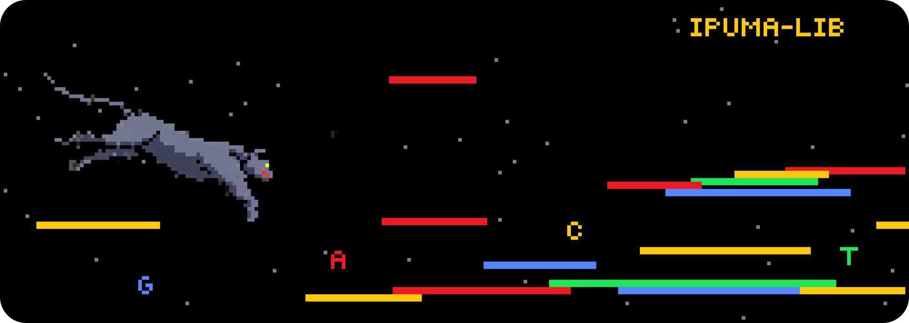

# IPUMA Library


Multi-purpose alignment library on the Graphcore Intelligent Processing Unit
(IPU).

This project contains the `ipuma-library` which implements implementations of
the Smith-Waterman alignment algorithm for the IPU.

## Installation

Get the xdrop branch and download all necessary submodules.

```bash
$ git clone --recurse-submodules -b xdrop https://github.com/xiamaz/ipuma-lib.git
```


### Requirements

The following software are required for building and running the alignment
libraries:

```text
poplar-sdk >= 2.6.0
cmake >= 3.22.2
gcc >= 11.2.0
```

### Building

```bash
$ mkdir -p build
$ cd build
$ cmake -DCMAKE_BUILD_TYPE=Release -GNinja ..
$ ninja
```

## Downloading datasets

Download datasets for ipuma benchmarks using the following commands.

Create a folder, `cd` into that directory and download the datasets:

```bash
wget -O cmps_celegans_multi.json.gz 'https://charitede-my.sharepoint.com/:u:/g/personal/max_zhao_charite_de/Ef359x9kGYBGj2u9tqNT5I0BRiIUqiGTEyUfa8fAeZxr7w?e=vZLaly&download=1'
wget -O seqs_celegans_multi.json.gz 'https://charitede-my.sharepoint.com/:u:/g/personal/max_zhao_charite_de/Ec5vuzv1PRdHimtQOSmnNHwBvQH_UYkvwpQ8s_anqkFidQ?e=lbuZeN&download=1'
wget -O cmps_ecoli_multi_single.json.gz 'https://charitede-my.sharepoint.com/:u:/g/personal/max_zhao_charite_de/Eb7k4SH0_3pAgWTdRch5PCcBP5qqorg-npgcfKzmLozyiw?e=3oUDO8&download=1'
wget -O seqs_ecoli_multi_single.json.gz 'https://charitede-my.sharepoint.com/:u:/g/personal/max_zhao_charite_de/EUP1_e2wRaNJvc8FAorMNsEBKJdVXZhG0q4gSJXghm854A?e=xEYtB9&download=1'
wget -O cmps_ecoli100_multi.json.gz 'https://charitede-my.sharepoint.com/:u:/g/personal/max_zhao_charite_de/EVtNR7Yaq_dMvyQH5JSIYZsBCerh4lM3rzjCjhnKtVXB_w?e=380yq9&download=1'
wget -O seqs_ecoli100_multi.json.gz 'https://charitede-my.sharepoint.com/:u:/g/personal/max_zhao_charite_de/EYARatFXtaRCmWVyvvG6OtoBC3lTWAh1rlG8trMIjM_h2g?e=6FSb88&download=1'
wget -O cmps_simulated85_multi.json.gz 'https://charitede-my.sharepoint.com/:u:/g/personal/max_zhao_charite_de/EQjeZHwGfblLhBx-mxjzKSMBwqH_CuHhMXNvn4GDAnWM8g?e=d53abr&download=1'
wget -O seqs_simulated85_multi.json.gz 'https://charitede-my.sharepoint.com/:u:/g/personal/max_zhao_charite_de/Ef0gzSn7BNZFsLiRdf3T2NkBj3UQzM-0ySLiHTlnNF4UbQ?e=obbv2l&download=1'
```

Unzip all files in the folder:

```bash
pigz -d *.json.gz
```

A fully automated download script can also be found in `scripts/ipusw_benchmark/download_datasets.sh`.

## Generate benchmark results on datasets

After downloading datasets, benchmarking results can be generated by using the following scripts. Execute these from the `ipuma-lib` directory:

```bash
$ bash ./scripts/ipusw_benchmark/ipush_bench.sh
```

Inside the script the number of devices and the path to the dataset might need to be adapted to the local system/configuration.

After execution, the resulting scores and logs can be found in `output/ipusw_benchmark_final` under the respective hostname of the system. The `.log` file will contain the performance results with output scores being stored in a `_scores.json` file for inspection.

## Testing

Correctness tests are contained in `ipuma-tests`.

```bash
$ build/test/ipuma-tests
```

## Running

The `ipusw` binary can be used to perform benchmark measurements on specified
datasets on the IPU.

Use `ipusw --help` to see available options.

The `cpusw` binary is a wrapper around
[StripedSmithWaterman](https://github.com/mengyao/Complete-Striped-Smith-Waterman-Library).

### Running paper benchmarks

The `./scripts/run_ipusw_benchmarks_mult.sh` script will execute IPU-based
alignment benchmarks.

The script expects alignment benchmark datasets to be located in `./download`
and will output log files to `./output`.

The script *optionally* accepts a name for the execution, otherwise
**`ipuswrun`** will be used:

```bash
$ ./scripts/run_ipusw_benchmarks_mult.sh [NAME]
```

The *StripedSmithWaterman* CPU benchmark results can be obtained by the
following command, the parameter is optional and defaults to **`cpuswrun`**:

```bash
$ ./scripts/run_cpusw.sh [NAME]
```

After executing either script, a folder containing logs will be created inside
the `./output/*` directory. These logs can be parsed into CSV format using the
following script:

```bash
$ ./scripts/merge_results_rep.sh ./output/<NAME> out.csv
```

### Obtaining seqan results

`seqan` uses an existing [align_bench](https://github.com/rrahn/align_bench)
wrapper. The following commands will automatically build and execute the
experiments for seqan:

```bash
$ ./scripts/run_seqan.sh
```

This will pull and build seqan inside the `scripts/seqan` folders and output
result logs into `scripts/seqan/results`.

The benchmark results in a table format will be output to **stdout**.
